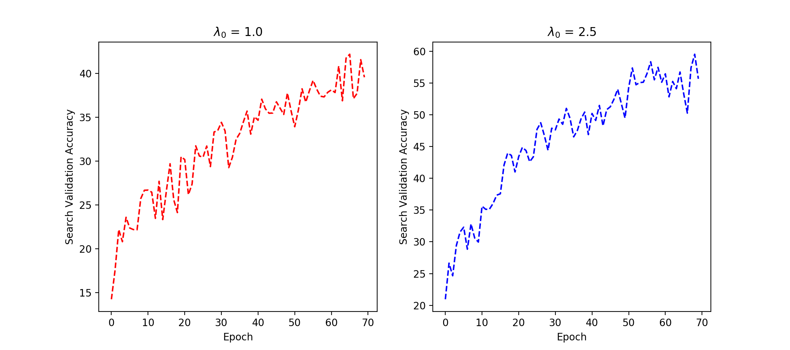
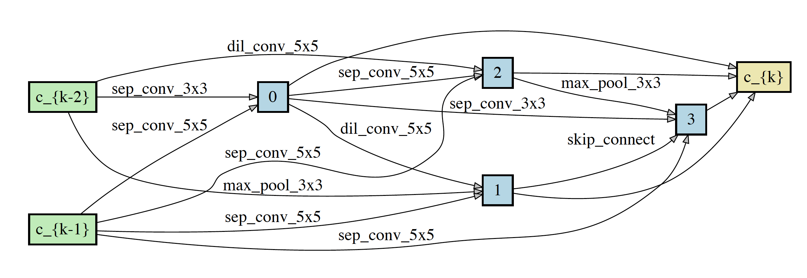
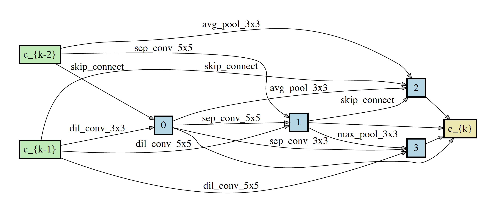

# SNAS(Stochastic Neural Architecture Search)
Pytorch implementation of SNAS (Caution : This is not official version and was not written by the author of the paper)

## Requirements
```
Python >= 3.6.5, PyTorch == 0.1
```

## Datasets
Cifar-10 datasets were used, (5000 for training / 5000 for validation).

Note that the authors of the paper used 25000 images for training and validation set, respectively.

## Hyperparaeters
Overall, I followed hyperparameters that were given in the paper.

However, there are several parameters that were not given in the paper.

Ex) Softmax Temperature ($\lambda_{0}$) , annealiation rate of the softmax temperature, parameters regarding the levels of resource constraints

Specifically, I found that search validation accuracy is highly influenced by initial softmax temperature (See Figure 1 for detail)
# Run the training code without regularization
python main.py (can adjust hyperparameters in option/default_option,py)
## Search Validation Accuracy (without regularization)
<p align="center">

</p>
<p align="center">
Figure1 : Search Validation Accuracy with different initial softmax temperature
</p>
(Note : the model was not fully trained(<==>converged) due to the limited resources (E.g., GPU and TIME!!)

## Network Architecture (without regularization)
<p align="center">


</p>
<p align="center">
